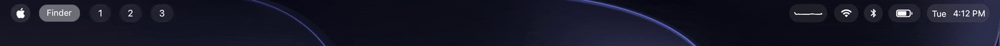
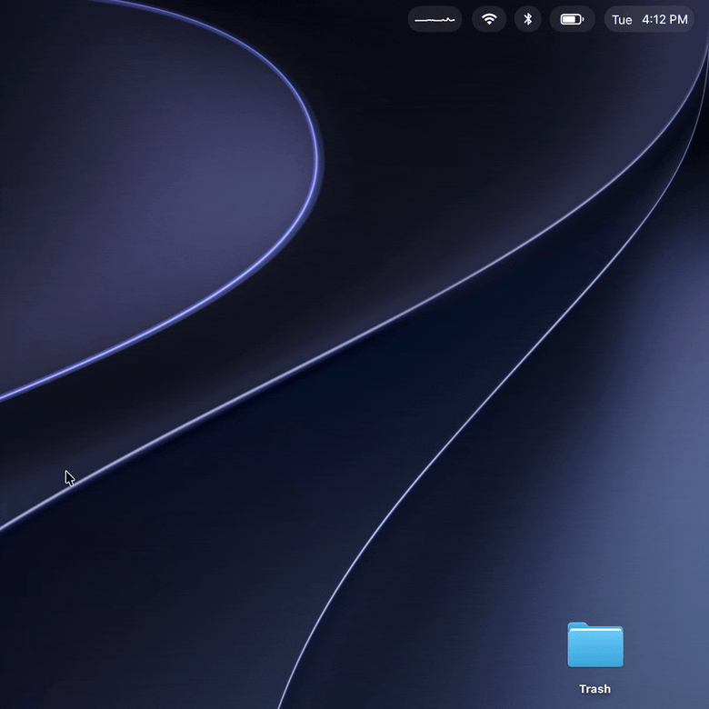
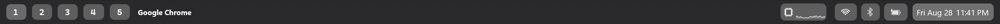
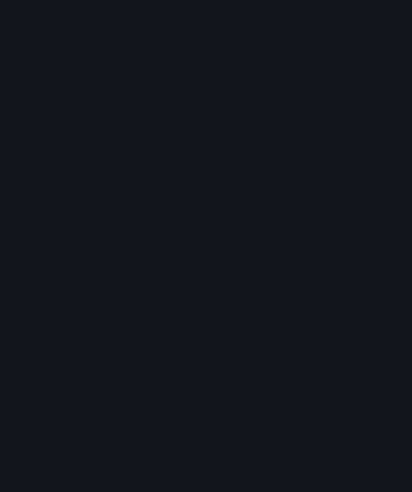
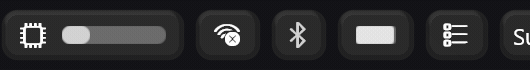
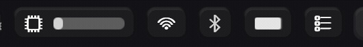
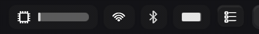
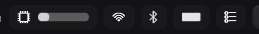

# YBar

**Top bar for macOS and Windows** — a GPU-rendered, scriptable status bar. On macOS, Metal renders everything (SDF shapes, glyph-atlas text, display-link-paced animation at near-zero CPU); a [native Windows port](#windows) mirrors the engine on Direct3D 11 + Windows.UI.Composition. The architecture is [sketchybar](https://github.com/FelixKratz/SketchyBar)'s proven live-object model: a single `ybar` binary that is both daemon and CLI client, driven entirely over IPC — plus an embedded Lua runtime so whole configs run in-process, and themes and scripts move between the two platforms with only OS-inherent edits.



*The `sketchybar-glass` theme: workspace pills tracking AeroSpace with live app
icons, a running Claude Code session indicator, CPU graph, and the app-menus
swap replacing the pills in place. The native macOS menu bar is hidden
underneath.*



*Popups are first-class items laid out by the same engine: a calendar month
grid (`popup.wrap_width` flow layout), arc gauges for CPU and memory, and a
Settings-style Wi-Fi picker — all on real `NSGlassEffectView` backdrops.
Network names in this recording are placeholders.*


```sh
ybar                                  # start the daemon
ybar --bar height=32 color=0xdd1e1e2e topmost=on
ybar --add item hello left \
     --set hello icon=sf:sparkles label="YBar is alive" \
                 background.drawing=on background.color=0xff313244 \
                 background.corner_radius=8 background.height=24
ybar --animate tanh 45 --set hello label.color=0xfff38ba8   # animated, GPU-paced
ybar --query hello                    # live state as JSON
```

## Why

- Keeps **sketchybar's command grammar and script contract** — existing configs port mechanically, and a pure-Lua compatibility shim runs SbarLua configs nearly verbatim.
- **GPU-rendered**: instanced SDF quads + a glyph atlas, damage-driven — zero GPU work while the bar is static (Metal on macOS, Direct3D 11 on Windows).
- **100% public APIs** in v1, so OS updates don't break it.
- On macOS 26+, pills and popups sit on **real Liquid Glass** (`NSGlassEffectView` backdrops — clear for bar pills, frosted for popups); older systems get an in-shader approximation. On Windows they map to a Mica backdrop — the blurred wallpaper composed under the pill or panel, which paints whether or not Transparency effects are on — under the same in-shader rim; bar-level `glass` maps to DWM Acrylic, which does follow that setting.

## What's here

YBar is a full engine, not a wrapper: GPU-rendered items and popups, a component library (graphs, sliders, arc gauges, images, brackets, flow-layout popups), an embedded Lua 5.4 runtime, a rich event/provider set, and packaging that owns its own privacy identity. The complete capability catalog — the surface you build widgets and themes against — lives in **[docs/EXTENDING.md](docs/EXTENDING.md)**.

## Install

```sh
brew tap NineFiveB/ybar     # github.com/NineFiveB/homebrew-ybar
brew install ybar           # latest tagged release; --HEAD builds current main
```

(Recent Homebrew asks you to confirm trusting a third-party tap on first
install — that prompt is expected; `brew trust NineFiveB/ybar` pre-approves it.)

See [docs/INSTALL.md](docs/INSTALL.md) for the release-zip route, first-run privacy-permission walkthrough, stable local signing (keeps TCC grants across rebuilds), and login autostart.

(Windows users: see [Windows](#windows) below.)

## Build (macOS)

Runs on macOS 14+. Building needs a Swift 6 toolchain; the Liquid Glass
backdrops additionally need the macOS 26 SDK (Xcode 26 / CLT 26) — on older
toolchains they compile out and the blur fallback carries the look. Shaders
compile at runtime, so Command Line Tools are enough — full Xcode is not
required.

```sh
make build       # swift build (scratch path outside iCloud-synced dirs)
make test
make app         # ~/Applications/YBar.app — the recommended way to run the daemon
open -g ~/Applications/YBar.app --args -c <your ybarrc.lua>
```

## Windows

YBar has a native **Windows 11** port — a separate C++ engine with the same soul. It lives on the [`windows` branch](../../tree/windows) (an orphan branch with its own toolchain and release cadence) and speaks the exact same command grammar, IPC protocol, and embedded Lua 5.4 API, so themes, configs, and shell scripts carry over with only OS-inherent edits (shell commands, glyph fonts, window-manager adapter).



*The `sketchybar-glass` theme on Windows 11, restyled to Fluent: workspace
pills tracking the active YTile/komorebi workspace (under YTile, empty
workspaces hide their pills), with the CPU and battery pills as continuous
fill meters, and the notification-area tray widget. The strip itself is flat
and near-black, carrying no Acrylic of its own — the material lives on the
pills instead, as below. Recorded before Mica landed.*



*Popups are first-class items laid out by the same engine: a Task
Manager-style system monitor with live CPU/GPU graphs, Fluent Wi-Fi and
Bluetooth flyouts (the Bluetooth one carries the system volume mixer — drag
sets the output volume through the daemon itself), a calendar month grid, a
battery panel, and the tray widget — left-click opens an app, right-click
quits it behind a confirm. Network and device names in this recording are
placeholders.*

### Mica

Item-level `background.glass` on Windows is **Mica**: a blurred-wallpaper
visual composed *under* the pill by the window's own Windows.UI.Composition
tree, tinted by the pill's own translucent fill, with the shader's lit rim on
top. The shipped theme turns it on for the widget pills, the calendar, the
focused workspace pill, and the popup panels.



*The same pills with `background.glass` toggled off and on. The material is
the desktop wallpaper, blurred and sampled in screen space: a pill shows the
patch of wallpaper it sits over, **not** the windows in between, and its own
fill is only the tint. On a wallpaper that is flat under the strip, as here,
the pills read as a lighter grey rather than as texture. Popup panels get the
same treatment across the whole panel; their rows stay flat, though a row can
cut its own window through the panel on the same gate a pill uses.*

Two things follow from where the material comes from. It needs the Windows 11
compositor, and it renders **whether or not** the system's Transparency
effects setting is on — unlike the DWM Acrylic that *bar-level* `glass` maps
to, which that setting switches off and which the shipped theme leaves off
anyway, so the pills have a flat strip to stand against. And it is not macOS's
Liquid Glass: Mica does not refract, so the rim is what gives a pill its edge.

### Depth effects (opt-in)

The engine can also lift and glow these pills; the shipped theme lights them
but leaves these two off. Glow is one flag away in Lua, `FOCUS_HALO` in
`items/spaces.lua`; elevation is a one-line swap in `helpers/hover.lua`. All
three GIFs below were recorded before Mica landed, by driving the same
`--animate` path a real hover takes, so no cursor is in frame.



*Hover elevation — `background.y_offset` plus a two-stop `gradient_color`
under the hover fill (`helpers/hover.lua`, `attachRaised`). Nothing moves as
far as input is concerned, so the hit rect stays exact.*



*Bevel lighting — the rim half of `background.glass`. The shader builds a real
surface normal from the rounded-box SDF and shades it Blinn-Phong, and the rim
itself costs no extra draw; today the same property also composes the Mica
material above.*



*Glow — `background.shadow.blur` with a light colour at zero offset. The same
soft-falloff quad is a drop shadow with a dark colour; either way the 112-byte
instance ABI shared with macOS is untouched. It sits one flag from the
focused-workspace halo and ships off, because the focused pill already reads
as the Mica one.*

- **Engine** — Direct3D 11 + a DirectWrite glyph atlas + Windows.UI.Composition, which is what carries the Mica layer (DirectComposition survives only as the frame clock), paced to the monitor's refresh rate (120 Hz verified), near-zero CPU while static: the macOS Metal engine's mirror.
- **Window management** — [komorebi](https://github.com/LGUG2Z/komorebi) and YTile as first-class workspace adapters (replacing AeroSpace/yabai), driven by their event streams rather than CLI polling.
- **Native providers** — battery/power, audio (WASAPI), network & Wi-Fi (`wlanapi` + connectivity-hint notifications; the Wi-Fi flyout's network list shells `netsh`), now-playing media (GSMTC), and in-process CPU/memory stats, all mapped to the same events as macOS.
- **Look** — the flagship `sketchybar-glass` theme is ported and restyled to Windows 11 Fluent: Mica pills and popup panels over a flat near-black strip with no Acrylic of its own (bar-level `glass` maps to the DWM Acrylic plate that follows your system **Transparency** setting; the theme leaves it off so the pills have something to stand against), and Fluent Wi-Fi / Bluetooth / system-monitor / calendar popups.

**Install** — one line in PowerShell: `irm https://raw.githubusercontent.com/NineFiveB/YBar/windows/scripts/install.ps1 | iex` — or with [Scoop](https://scoop.sh): `scoop install https://raw.githubusercontent.com/NineFiveB/YBar/windows/packaging/scoop/ybar-win.json` — or download `ybar-win-<version>-x64.zip` from a [`win-v*` release](../../releases). Release binaries are Authenticode-signed (Azure Trusted Signing); a winget manifest is staged under `packaging/` on the `windows` branch.

**Build** (Windows 11 22H2+, Visual Studio 2022 C++ tools, CMake ≥ 3.25, [vcpkg](https://github.com/microsoft/vcpkg) with `VCPKG_ROOT` set):

```powershell
cmake --preset default
cmake --build --preset default
ctest --preset default
```

The full design and platform contract is in [docs/WINDOWS-PORT.md](docs/WINDOWS-PORT.md); the branch's own [README](../../blob/windows/README.md) has the source-tree map and packaging details.

## Config

Three surfaces, mixable at will:

- **Lua**: point the daemon at a `ybarrc.lua`; it runs inside the daemon with an `ybar.*` API (items as live objects, closures as event handlers, `animate`/`exec`/`delay`), plus a sketchybar-compatibility shim exposing the `sbar` API for existing SbarLua configs.
- **CLI**: any shell script or REPL can drive the same live-object model over the socket at runtime — the bar is not a parsed file.
- **JSONC**: point `-c` at a `.jsonc` file for a declarative bar — comments and trailing commas allowed, translated through the same command layer ([example](examples/jsonc-demo/ybar.jsonc)).

The example config's workspace pills speak both **AeroSpace** and **yabai** (native macOS Spaces) and pick the one actually running — the two can coexist installed side by side; see [examples/yabai-skhd](examples/yabai-skhd) for the yabai/skhd setup, including what needs yabai's scripting addition and what works without it. On Windows the same pills speak **komorebi** and **YTile** instead, driven off their event streams.

**Themes**: ship-selectable presets — `scripts/ybar-theme list|use <name>|install <git-url>`. See [docs/THEMES.md](docs/THEMES.md) for the gallery (Liquid Glass flagship, the darxk Waybar replication, and more) and how to publish your own. [examples/yabai-skhd](examples/yabai-skhd) has the yabai signal recipes (instant window-level updates; the CLI folds `$YABAI_*` signal vars into `--trigger` env) and an skhd setup driving the bar's hotkey-mode indicator pill.

## Acknowledgments

YBar stands on the shoulders of [sketchybar](https://github.com/FelixKratz/SketchyBar) by [Felix Kratz](https://github.com/FelixKratz) — the daemon/CLI live-object architecture, the command grammar, and the script contract all originate there, and YBar deliberately stays compatible with them (including the [SbarLua](https://github.com/FelixKratz/SbarLua) API surface). [Waybar](https://github.com/Alexays/Waybar) shaped the feature set — tooltips, the idle inhibitor, and the general "bar as a first-class desktop component" sensibility are its influence.

## License

[GPL-3.0](LICENSE). Copyright (C) 2026 AltimG. Vendored third-party code is
credited in [THIRD_PARTY.md](THIRD_PARTY.md).
